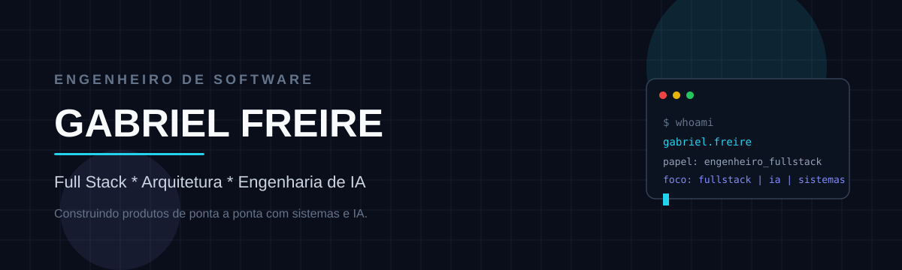

<!--
  GitHub Profile README — Gabriel Freire (devG4bs)
  Personalize:
  - Contact: LinkedIn + email abaixo
  - Featured Projects: substitua os placeholders
-->

<div align="center">

  

  <br/>

  

</div>

<br/>

<p align="center">
  
</p>

## 🎯 Engineering Focus

<p align="center">

| 👨‍💻 Software Engineer | 🏗️ System Architecture | 🤖 AI Engineering |
| :---: | :---: | :---: |
| ⚡ Backend & APIs | 🔌 MCP & Integrations | ☁️ Cloud & DevOps |

</p>

<p align="center">
  <strong><em>Building scalable systems, APIs and AI-powered automation.</em></strong>
</p>

<p align="center">
  
</p>

## 👋 About Me

Software Engineer focado em **backend**, **arquitetura de sistemas** e **automação inteligente**.

Interesse em construir sistemas escaláveis, APIs, microsserviços e soluções com inteligência artificial.

**Atualmente explorando:**

- AI Agents · LLM applications · MCP
- LangChain · LangGraph · Developer automation
- System architecture · Distributed systems

<p align="center">
  
</p>

## 🏛️ Architecture Mindset

Como eu penso sistemas — camadas claras, ownership explícito, da inteligência à persistência.

<p align="center">
  
</p>

<p align="center">
  
</p>

## 🤖 AI Engineering

Interesse prático em engenharia de IA aplicada a produto e tooling:

| Area | Focus |
| :--- | :--- |
| **LLM Applications** | applications com modelos em produção |
| **AI Agents** | agentes com tool calling e ownership |
| **LangChain / LangGraph** | orquestração e fluxos stateful |
| **MCP** | tools reais conectadas ao domínio |
| **Automation** | AI-powered developer automation |

<p align="center">
  
</p>

<p align="center">
  
</p>

## 🛠️ Tech Stack

### Languages

<p align="left">
  
</p>

`PHP` · `JavaScript` · `TypeScript` · `Python` · `SQL`

### Frontend

<p align="left">
  
</p>

`Vue.js` · `React` · `JavaScript` · `TypeScript` · `Vite`

### Backend

<p align="left">
  
</p>

`PHP` · `Node.js` · `Python` · `REST APIs` · `Microservices`

### AI / Automation

<p align="left">
  <a href="https://www.langchain.com/"></a>
  
  
  
  
  <a href="https://n8n.io/"></a>
</p>

### Databases

<p align="left">
  
</p>

### DevOps / Infrastructure

<p align="left">
  
</p>

`Docker` · `Kubernetes` · `Git` · `GitLab` · `Argo CD` · `Kong`

### Observability

<p align="left">
  
  
  
</p>

### Tools

<p align="left">
  
  
  
</p>

<p align="center">
  
</p>

## 🧩 What I Build

<table>
  <tr>
    <td width="50%" valign="top">
      <h3>⚡ Backend Systems</h3>
      <p>APIs, microsserviços, integrações e serviços escaláveis.</p>
    </td>
    <td width="50%" valign="top">
      <h3>🏗️ System Architecture</h3>
      <p>Separação de responsabilidades, domínio e integrações.</p>
    </td>
  </tr>
  <tr>
    <td width="50%" valign="top">
      <h3>🤖 AI Automation</h3>
      <p>Agentes, LLMs, automações e tooling para engenharia.</p>
    </td>
    <td width="50%" valign="top">
      <h3>🔌 Integrations</h3>
      <p>APIs, sistemas internos, GitLab, Jira e serviços externos.</p>
    </td>
  </tr>
  <tr>
    <td colspan="2" valign="top">
      <h3>☁️ Infrastructure</h3>
      <p>Docker, Kubernetes, CI/CD, observabilidade e ambientes distribuídos.</p>
    </td>
  </tr>
</table>

<p align="center">
  
</p>

## 📊 GitHub Stats

<div align="center">
  
  
</div>

<br/>

<div align="center">
  
</div>

<br/>

<div align="center">
  
</div>

<p align="center">
  
</p>

## 🚀 Featured Projects

<!-- PERSONALIZE: substitua título, descrição, tech e link de cada projeto -->

<table>
  <tr>
    <td width="33%" valign="top">
      <h3>🚀 Project Name</h3>
      <!-- link: https://github.com/devG4bs/REPO -->
      <p>Descrição curta do projeto e do problema que resolve.</p>
      <p><strong>Tech:</strong> <code>PHP</code> · <code>PostgreSQL</code> · <code>Redis</code></p>
    </td>
    <td width="33%" valign="top">
      <h3>🤖 AI Project</h3>
      <!-- link: https://github.com/devG4bs/REPO -->
      <p>Descrição curta do projeto de agentes / LLM / MCP.</p>
      <p><strong>Tech:</strong> <code>Python</code> · <code>LangGraph</code> · <code>MCP</code></p>
    </td>
    <td width="33%" valign="top">
      <h3>⚡ Backend Project</h3>
      <!-- link: https://github.com/devG4bs/REPO -->
      <p>Descrição curta da API / serviço / integração.</p>
      <p><strong>Tech:</strong> <code>Node.js</code> · <code>PostgreSQL</code> · <code>Docker</code></p>
    </td>
  </tr>
</table>

<p align="center">
  
</p>

## 🔭 Currently Exploring

```text
AI Agents  ·  LLM Engineering  ·  MCP  ·  LangGraph
System Architecture  ·  Distributed Systems
Developer Automation  ·  Cloud Infrastructure
```

<p align="center">
  
</p>

## 🧠 Engineering Principles

- Keep systems simple
- Design for maintainability
- Automate repetitive work
- Build observable systems
- Prefer clear architecture
- Use AI as an engineering tool
- Solve problems before adding complexity

<p align="center">
  
</p>

## 📬 Connect

<p align="center">
  <a href="https://github.com/devG4bs"></a>
  <!-- PERSONALIZE LinkedIn: troque YOUR_LINKEDIN -->
  <a href="https://www.linkedin.com/in/YOUR_LINKEDIN"></a>
  <!-- PERSONALIZE Email: troque YOUR_EMAIL -->
  <a href="mailto:YOUR_EMAIL"></a>
</p>

<br/>

<p align="center">
  
</p>

<p align="center">
  <sub>Software Engineer · Backend · Architecture · AI Engineering</sub>
</p>
